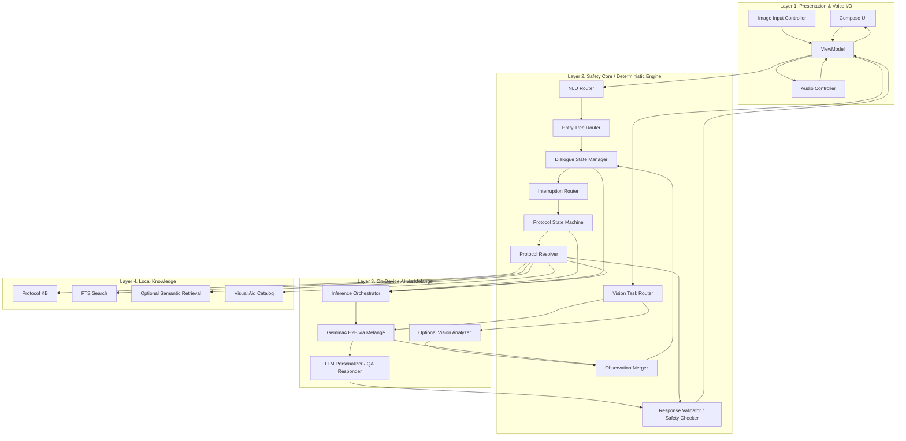

# 긴급 대응 프로토콜 오프라인 AI 모바일 앱 아키텍처

## 1. 문서 목적

이 문서는 안드로이드 기반 오프라인 AI 응급 대응 앱을 구현하기 위한 상세 아키텍처 명세다. 목표는 AI 에이전트나 개발자가 이 문서만 읽고도 바로 앱 골격과 핵심 모듈을 만들 수 있도록 하는 것이다.

본 프로젝트의 핵심 원칙은 다음과 같다.

- 앱의 **주요 기능(primary functionality)** 은 반드시 **온디바이스**에서 동작한다.
- **진단/분기/다음 행동 결정**은 deterministic한 로직이 담당한다.
- **LLM은 프로토콜 문장을 개인화하고, 맥락 질문에 답하고, 응답을 자연스럽게 만드는 역할**을 맡는다.
- LLM이 느리거나 실패하더라도 **핵심 프로토콜 안내는 중단되지 않아야 한다**.
- 애매한 입력은 질병명 중심이 아니라 **실제 응급 디스패치와 유사한 Entry Tree**를 통해 생명위협 여부부터 평가한다.

이 앱은 일반 챗봇이 아니라 **현장형 프로토콜 실행기**로 설계한다.

---

## 2. 제품 목표

### 2.1 핵심 사용자 가치

- 사용자가 응급 상황에서 짧고 모호한 말만 해도, 앱이 빠르게 상태를 분류한다.
- 앱은 우선순위가 높은 질문부터 던져서 생명 위협 여부를 먼저 파악한다.
- 프로토콜의 실제 단계는 구조화된 매뉴얼에서 가져오고, LLM은 이를 사용자 상황에 맞게 설명한다.
- 사용자가 단계별 안내를 듣는 도중에 돌발 질문을 해도 현재 단계의 맥락을 잃지 않는다.
- 네트워크가 없어도 작동해야 한다.

### 2.2 비목표

- 의학적 최종 진단 엔진을 만들지 않는다.
- 자유 생성형 의료 상담 챗봇을 만들지 않는다.
- 핵심 처치를 LLM이 새로 생성하게 하지 않는다.

---

## 3. 시스템 개요

### 3.1 설계 철학

시스템은 두 개의 평면으로 나뉜다.

1. **Decision Plane**
   - 사용자의 입력에서 현재 응급상황을 분류한다.
   - 생명위협 여부를 빠르게 판단한다.
   - 어떤 상태 트리로 들어가야 하는지 결정한다.
   - 다음 행동(step)을 결정한다.

2. **Response Plane**
   - 결정된 step을 사용자의 상황에 맞게 다시 표현한다.
   - 짧게/천천히/보호자 대상 등 말투를 조절한다.
   - step 도중 들어온 질문에 현재 맥락을 유지한 채 답한다.

### 3.2 핵심 실행 원칙

- **무엇을 할지**는 State Machine이 결정한다.
- **어떻게 말할지**는 LLM이 결정한다.
- **현재 질문이 단순 제어인지, 단계 관련 질문인지, 새로운 상태 변화 보고인지**는 Interruption Router가 구분한다.
- **LLM 응답이 프로토콜을 벗어났는지**는 Validator가 검사한다.

### 3.3 멀티모달 턴 원칙

모든 사용자 입력 턴은 아래 모달리티의 조합으로 처리할 수 있어야 한다.

- 텍스트
- 음성 전사 결과
- 사용자 업로드 이미지
- 시스템 컨텍스트

핵심 원칙:

- 이미지는 **모든 chat 흐름에서 optional input** 이다.
- 시각 보조 에셋은 **모든 응답에서 optional output** 이다.
- 이미지가 없더라도 앱의 핵심 플로우는 동일하게 동작해야 한다.
- 이미지 분석 결과는 최종 사실이 아니라 **관찰 기반 후보 정보(observed facts)** 로 저장한다.
- 중요 슬롯은 state machine 또는 사용자 확인을 통해 확정한다.

---

## 4. 기술 스택

### 4.1 앱 및 UI

- Language: Kotlin
- UI: Jetpack Compose
- State holder: ViewModel
- Reactive stream: Kotlin Coroutines + `StateFlow`

### 4.2 오디오 I/O

- STT: Android `SpeechRecognizer` 오프라인 모드
- TTS: Android `TextToSpeech`
- Barge-in: TTS 출력 중 사용자 음성 감지 시 중단

### 4.3 이미지 I/O

- 입력: CameraX 또는 시스템 사진 선택기
- 출력: 로컬 에셋 이미지, 다이어그램, 경고 일러스트
- 이미지 사용 방식:
  - 사용자 업로드 이미지: optional evidence input
  - 앱 에셋 이미지: optional explanatory output

### 4.4 AI 런타임

- Sponsor Tooling: ZETIC Melange
- Primary LLM: Gemma4 E2B (Edge 2B)
- Runtime execution target: CPU / GPU / NPU 중 Melange가 기기별 최적 백엔드 선택
- Optional vision model: Melange로 배포하는 detector / classifier / lightweight vision encoder
- MVP 기본값: Gemma4 E2B 단독 멀티모달
- 확장 기본값: Gemma4 E2B + optional specialized vision model

### 4.5 지식 저장소

- Canonical protocol store: JSON assets 또는 SQLite
- 검색: SQLite FTS 우선
- RAG: MVP 필수 아님, 추후 선택적 추가
- Visual aid assets: 로컬 이미지 에셋 (`WebP`, `PNG`, `VectorDrawable`)

### 4.6 데이터 저장

- Room 또는 SQLite
- 앱 설정, 마지막 상태, 슬롯 캐시, 진입 기록 저장
- 멀티모달 턴 기록, 관찰값, 이미지 분석 결과 저장

---

## 5. 레이어드 아키텍처



---

## 6. 주요 모듈 상세

### 6.1 Audio Controller

책임:

- 오프라인 STT 시작/중지
- TTS 재생/정지
- Barge-in 감지
- 음성 이벤트를 `VoiceEvent`로 표준화

핵심 정책:

- TTS 재생 중 사용자 발화 감지 시 즉시 TTS 중단
- STT 결과는 partial/final을 구분하지만, 상태 전이에 사용되는 것은 final 우선
- STT 실패 시 텍스트 입력 fallback 제공

### 6.1b Image Input Controller

책임:

- 카메라 촬영, 갤러리 선택, 권한 처리
- 이미지 URI를 안전한 앱 내부 참조로 변환
- 이미지 메타데이터와 함께 `UserTurn`에 첨부
- 동일 턴에 여러 장의 이미지가 들어와도 정규화

핵심 정책:

- 이미지 입력은 언제나 optional이다.
- 이미지 분석 실패 시에도 턴 처리는 계속된다.
- 원본 이미지는 필요 시에만 유지하고, 가능한 한 앱 내부 캐시 기준으로 관리한다.

### 6.2 Compose UI

책임:

- `UiState`만 구독하여 렌더링
- 현재 단계, 위험 경고, 체크리스트, 타이머, 음성 상태 표시
- 현재 step에 연결된 시각 보조 이미지 표시
- 사용자가 업로드한 최근 이미지와 분석 결과 표시
- 수동 입력, 다음 단계, 반복 듣기, 119 호출 유도 버튼 표시

UI 원칙:

- 마케팅형 UI 금지
- 응급 도구처럼 단순하고 빠르게 스캔 가능해야 함
- 현재 step, 지금 해야 할 행동, 금지사항이 가장 위에 보여야 함
- 시각 보조 이미지는 현재 step 아래에 고정된 위치로 노출하고, 응급 상황에서 방해되지 않도록 한 번에 1~2개만 보여준다.

### 6.3 ViewModel

책임:

- 앱의 단일 이벤트 허브 역할
- `VoiceEvent`, `UserAction`, `SystemEvent`를 받아 처리
- 텍스트/음성/이미지를 하나의 `UserTurn`으로 조립
- `DialogueState`, `UiState`, `AudioState` 동기화

권장 구성:

- `EmergencyViewModel`
- `MutableStateFlow<UiState>`
- 내부적으로 `reduce(event)` 패턴 사용

### 6.4 NLU Router

MVP 기준 우선순위:

1. 정규식
2. 키워드 매칭
3. 사전 기반 phrase normalization
4. 선택적으로 TF-IDF 또는 초경량 classifier

주요 출력:

- `entryIntent`
- `domainHints`
- `slots`
- `confidence`

예시:

- "내 친구가 쓰러졌어" -> `entryIntent = PERSON_COLLAPSED`
- "팔에 물집이 잡혔어" -> `entryIntent = INJURY_REPORT`, `domainHint = BURN`
- "숨을 잘 못 쉬어" -> `entryIntent = BREATHING_PROBLEM`

중요:

- NLU는 최종 의료판단을 하지 않는다.
- NLU는 상태 트리 진입을 돕는 약한 구조화 계층이다.

### 6.5 Entry Tree Router

역할:

- 애매한 입력을 받아 실제 디스패치처럼 생명 위협 질문부터 시작
- 명확한 손상은 바로 도메인 트리로 라우팅

라우팅 기준:

- **명확한 손상/사건**: `BurnTree`, `BleedingTree`, `ChokingTree` 등으로 바로 진입
- **애매한 상황**: `GeneralEntryTree` 진입
- **쓰러짐/무반응**: `CollapsedPersonEntryTree`

### 6.5b Vision Task Router

역할:

- 이미지가 들어온 현재 턴에서 이미지 해석 목적을 먼저 결정
- 같은 이미지라도 대화 맥락에 따라 다른 태스크로 라우팅

주요 출력:

- `KIT_DETECTION`
- `STEP_VERIFICATION`
- `INJURY_OBSERVATION`
- `GENERAL_MULTIMODAL_QA`
- `UNKNOWN`

판단 기준:

- 현재 `DialogueState`
- 현재 `protocol_id`, `step_id`
- 직전 시스템 응답 타입
- 사용자 텍스트
- 현재 step이 기대하는 시각 확인 항목

핵심 원칙:

- "이미지에 무엇이 보이는가"와 "사용자가 왜 이 이미지를 보냈는가"를 분리한다.
- 목적 판단은 이미지 내용 단독이 아니라 대화 맥락 기반으로 한다.
- MVP에서는 규칙 기반 라우팅으로 시작하고, 확장 시 경량 classifier를 추가할 수 있다.

### 6.6 Protocol State Machine

역할:

- 현재 state node 유지
- 슬롯 충족 여부 평가
- 다음 질문 또는 다음 행동 결정
- `protocol_id`, `step_id`, `safety_flags` 도출

상태 노드 유형:

- `question`
- `instruction`
- `route`
- `router`
- `checklist`
- `terminal`

### 6.6b Observation Merger

역할:

- 텍스트, 음성, 이미지 분석 결과를 하나의 turn context로 병합
- 이미지에서 나온 결과를 `observed facts`로 변환
- confidence와 source를 보존한 채 슬롯 후보를 갱신

핵심 원칙:

- 이미지 분석 결과는 기본적으로 `VISION_SUGGESTED` 상태다.
- 생명위협 분기에 영향을 주는 정보는 사용자 확인 또는 추가 질문을 거친다.
- user reported 정보와 충돌하면 충돌 상태를 유지하고 재질문한다.

### 6.7 Protocol Resolver

역할:

- canonical protocol 문장을 구조화된 데이터에서 조회
- 현재 step의 원문, 금지사항, follow-up hint, escalation 조건, 연결된 시각 보조 에셋 반환

핵심 원칙:

- 상태 엔진이 `protocol_id`를 알면, 우선 direct lookup을 사용한다.
- 핵심 응급 프로토콜에는 RAG가 필수가 아니다.
- RAG는 설명/근거/예외처리용으로만 선택적으로 사용한다.
- 시각 자료 선택도 LLM이 아니라 protocol metadata 기반 deterministic lookup으로 처리한다.

### 6.8 Interruption Router

역할:

- step 재생 중 들어온 새로운 발화를 분류

분류 타입:

- `CONTROL_INTENT`
  - 예: "다 했어", "다음", "멈춰", "다시 말해줘"
- `CLARIFICATION_QUESTION`
  - 예: "왜 10분이야?", "얼음 써도 돼?"
- `STATE_CHANGING_REPORT`
  - 예: "잠깐 피도 나", "환자가 숨을 이상하게 쉬어"
- `OUT_OF_DOMAIN`

핵심 동작:

- control intent는 LLM 없이 즉시 처리
- clarification은 현재 step context를 붙여 LLM에 전달
- state-changing report는 기존 step보다 우선 처리하고 state machine 재평가

### 6.9 Inference Orchestrator

역할:

- Melange 호출 시점 판단
- 프롬프트 조립
- 토큰 제한
- 취소 / timeout / retry 관리
- 멀티모달 턴에서 Gemma와 optional vision model 중 적절한 경로 선택

LLM 호출이 필요한 대표 상황:

- canonical step 개인화
- 현재 단계에 대한 질문 답변
- 긴 문장을 짧게 요약
- 보호자/어린이/공황 상태 사용자에 맞는 표현 조정

LLM 호출이 필요 없는 대표 상황:

- 다음 단계로 이동
- 완료 체크
- 반복 듣기
- step 자체의 canonical text 조회

### 6.9b Vision Analyzer

역할:

- Melange 위에서 동작하는 optional specialized vision model 실행
- 객체 탐지, 분류, 자세 확인 등 구조화된 시각 태스크 처리

권장 사용처:

- 응급처치 키트 인식
- 도구/물품 탐지
- step 결과 확인용 제한된 verification

비권장 사용처:

- 최종 의학적 진단 확정
- 생명위협 여부의 단독 판단
- 넓은 범위의 자유 생성형 의료 해석

### 6.10 Safety Checker / Response Validator

역할:

- LLM 응답이 canonical protocol의 의미를 벗어났는지 검사
- 필수 키워드 누락, 금지사항 위반, step 순서 변경 감지

실패 시 fallback:

- canonical 원문 그대로 출력
- 짧은 canned response 사용

### 6.11 Visual Aid Resolver

역할:

- 현재 `protocol_id`와 `step_id`에 연결된 이미지 에셋 목록 반환
- 도메인/환자 상태/표현 목적에 따라 적절한 에셋 variant 선택
- 이미지 설명 캡션과 접근성 텍스트 제공

핵심 원칙:

- 이미지 선택은 항상 deterministic metadata 매핑으로 수행한다.
- LLM은 이미지를 생성하지 않고, 보여줄 이미지를 결정하지도 않는다.
- 이미지가 없더라도 step 진행은 그대로 가능해야 한다.
- 같은 step에 너무 많은 이미지를 노출하지 않도록 기본 제한은 2개로 둔다.

---

## 7. 핵심 사용자 플로우

### 7.1 명확한 손상 케이스

예: "팔에 물집이 잡혔어"

1. STT 결과 수신
2. NLU에서 `BURN` 힌트 추출
3. `BurnTree` 진입
4. 필요한 슬롯 확인
5. `protocol_id = burn_second_degree_general`
6. Protocol Resolver가 canonical steps 조회
7. LLM이 slot 기반으로 step을 개인화
8. TTS 출력
9. 사용자가 "다 했어" 말하면 다음 step

### 7.2 애매한 상황 케이스

예: "내 친구가 쓰러졌어"

1. STT 결과 수신
2. NLU에서 `entryIntent = PERSON_COLLAPSED`
3. `CollapsedPersonEntryTree` 진입
4. 질문:
   - 주변은 안전한가?
   - 반응하는가?
   - 정상적으로 숨 쉬는가?
5. 답에 따라
   - CPR tree
   - Unresponsive but breathing tree
   - Seizure tree
   - Breathing problem tree

### 7.3 단계 도중 돌발 질문

예: 화상 냉각 step 재생 도중 "얼음 써도 돼?"

1. Audio Controller가 barge-in 감지
2. TTS 즉시 중단
3. Interruption Router가 `CLARIFICATION_QUESTION`로 분류
4. 현재 step context와 금지사항을 포함해 LLM 호출
5. Validator가 응답 검사
6. 답변 후 현재 step으로 복귀

### 7.4 시각 자료 포함 응답

예: CPR 단계 또는 붕대 감기 단계

1. State Machine이 현재 `protocol_id`와 `step_id` 결정
2. Protocol Resolver가 step metadata와 `asset_refs` 반환
3. Visual Aid Resolver가 에셋 카탈로그에서 실제 이미지 파일과 캡션 조회
4. ViewModel이 `UiState.visualAids` 갱신
5. Compose UI가 텍스트 step 바로 아래에 이미지 표시
6. LLM은 필요 시 이미지와 함께 읽힐 짧은 설명만 생성하거나 canonical 문장을 개인화

### 7.5 이미지가 포함된 사용자 턴

예: "이렇게 붕대 감은 거 맞아?" + 이미지

1. 사용자가 텍스트/음성/이미지 중 하나 이상으로 턴 생성
2. ViewModel이 이를 `UserTurn`으로 정규화
3. 이미지가 있으면 `Vision Task Router`가 처리 목적 결정
4. MVP에서는 Gemma4 E2B가 멀티모달 입력을 직접 처리
5. 확장판에서는 task type에 따라 optional vision model 또는 Gemma로 라우팅
6. 결과는 `ObservedFact` 목록으로 병합
7. State Machine이 필요 시 재질문하거나 현재 step 검증 응답 생성

---

## 8. 실제 디스패치 스타일 Entry Tree 설계

### 8.1 설계 기준

상태 트리는 다음 기준으로 생성한다.

- 질문이 **다음 행동을 실제로 바꾸는가**
- 사용자가 **지금 관찰해서 답할 수 있는가**
- 오답이 나와도 **위험하게 빗나가지 않는가**

### 8.2 트리 유형

1. **Entry / Triage Tree**
   - 애매한 입력에 대응
   - 생명위협 여부 우선 평가

2. **Domain-Specific Tree**
   - 화상
   - 출혈
   - 경련
   - 질식
   - 흉통
   - 중독
   - 무반응/심정지

### 8.3 추천 최상위 Entry Tree

```text
Root Entry
├─ 명확한 손상/사건
│  ├─ 화상
│  ├─ 출혈
│  ├─ 외상
│  ├─ 질식
│  └─ 중독
├─ 애매한 상태/증상
│  ├─ 쓰러짐
│  ├─ 호흡곤란
│  ├─ 흉통
│  ├─ 경련
│  ├─ 의식 이상
│  └─ 알레르기 반응 의심
└─ 일반/불명확
   └─ GeneralEntryTree
```

### 8.4 Collapsed Person Entry Tree 권장 흐름

```text
1. 현장이 안전한가?
2. 환자에게 반응이 있는가?
3. 정상적으로 호흡하는가?
4. 심한 출혈이 있는가?
5. 경련 중인가?
6. 알려진 원인이 있는가? (외상/열/약물/당뇨 등)
```

---

## 9. RAG 전략

### 9.1 결론

핵심 프로토콜 경로에는 RAG가 필수가 아니다.

### 9.2 Direct Lookup 우선

다음은 direct lookup으로 해결한다.

- 표준 step
- 체크리스트
- 금지사항
- 다음 단계
- escalation 조건

### 9.3 RAG가 필요한 상황

- 구조화되지 않은 긴 문서를 참조해야 할 때
- 사용자가 "왜?"를 묻는 설명형 질문
- 예외 상황 조합이 많을 때
- 추후 매뉴얼이 확장될 때

### 9.4 권장 도입 순서

1. JSON/SQLite 기반 canonical protocol
2. SQLite FTS
3. 필요 시 semantic retrieval

---

## 10. Melange + Gemma4 E2B 통합 전략

### 10.1 역할 정의

Melange는 단순 모델 실행기가 아니라 다음 역할을 가진다.

- 디바이스에서 모델 배포
- CPU/GPU/NPU 벤치마킹
- 최적 실행 백엔드 선택
- 모델 로딩/세션 관리

Gemma4 E2B는 다음 역할을 가진다.

- canonical step 개인화
- 현재 step 관련 질문에 답변
- 요약/재서술
- 사용자 말투에 맞춘 표현 조정
- MVP에서 이미지가 포함된 턴의 범용 멀티모달 해석
- 확장판에서 vision 결과를 받아 자연어 응답과 구조화된 설명 생성

Gemma4 E2B는 다음 역할을 맡지 않는다.

- 핵심 의료 판단 최종 결정
- 완전히 새로운 프로토콜 생성
- 검증되지 않은 단계 추가
- specialized detector가 더 잘하는 객체 탐지의 최종 실행 엔진 역할

### 10.2 아키텍처 프로파일

이 프로젝트는 처음부터 아래 두 프로파일을 모두 지원하도록 설계한다.

#### Profile A. Gemma-only MVP

목표:

- 해커톤에서 가장 빠르게 구현 가능한 버전
- 이미지도 포함할 수 있지만 모델은 Gemma4 E2B 하나만 사용

이미지 처리 방식:

- 이미지가 포함된 턴은 `Vision Task Router`가 목적만 분류
- 실제 시각 해석은 Gemma4 E2B가 직접 수행
- 결과는 `ObservedFact` JSON으로 표준화

장점:

- 구현 단순
- 모델 배포/디버깅 부담이 적음
- 멀티모달 대화 UX를 빨리 완성 가능

제약:

- 응급키트 탐지나 자세 확인처럼 반복적 태스크에서 효율이 낮을 수 있음
- 구조화된 detection 품질이 전용 비전 모델보다 흔들릴 수 있음

#### Profile B. Hybrid Vision Expansion

목표:

- 반복적이고 구조화된 시각 태스크의 속도와 안정성 향상
- Gemma를 대화/설명/통합 reasoning에 집중

이미지 처리 방식:

- `Vision Task Router`가 목적 분류
- `KIT_DETECTION`, `STEP_VERIFICATION` 같은 제한된 태스크는 specialized vision model 실행
- `GENERAL_MULTIMODAL_QA` 또는 복잡한 맥락 질문은 Gemma4 E2B 실행
- 둘의 결과는 동일한 `ObservedFact` 인터페이스로 병합

장점:

- 속도 개선
- 배터리/연산 최적화
- state machine에 넣기 쉬운 구조화 출력 확보

제약:

- 모델이 2개 이상이므로 운영 복잡도 증가
- 태스크 라우팅 정책과 테스트 범위가 넓어짐

### 10.3 설계 원칙: MVP도 하이브리드 준비 상태로 만든다

MVP에서도 아래 인터페이스를 먼저 도입한다.

- `VisionTaskRouter`
- `MultimodalInterpreter`
- `ObservedFact`
- `TurnContext`

즉, MVP에서는 구현체가 Gemma 하나뿐이더라도, 상위 계층은 이미 하이브리드 전환 가능한 인터페이스를 사용한다.

예:

- MVP: `GemmaMultimodalInterpreter`
- 확장판: `HybridMultimodalInterpreter`

### 10.4 Melange Adapter 인터페이스

권장 인터페이스:

```kotlin
interface OnDeviceLlmEngine {
    suspend fun warmup(): Result<Unit>
    suspend fun generate(request: LlmRequest): Result<LlmResponse>
    suspend fun cancelCurrent()
    fun backendInfo(): ModelBackendInfo
}
```

```kotlin
interface MultimodalInterpreter {
    suspend fun interpret(turn: UserTurn, context: TurnContext): Result<List<ObservedFact>>
}
```

```kotlin
interface VisionModelEngine {
    suspend fun analyze(task: VisionTaskType, turn: UserTurn, context: TurnContext): Result<List<ObservedFact>>
    fun backendInfo(): ModelBackendInfo
}
```

### 10.5 구현체 예시

Gemma MVP:

- `GemmaMultimodalInterpreter`
  - 내부적으로 Gemma4 E2B에 이미지+텍스트를 함께 전달
  - 출력은 구조화된 `ObservedFact` JSON

Hybrid 확장판:

- `HybridMultimodalInterpreter`
  - `VisionTaskRouter` 결과를 받아 적절한 엔진 선택
  - specialized task는 `VisionModelEngine`
  - 범용 질문은 `OnDeviceLlmEngine`
  - 최종 결과를 하나의 `ObservedFact` 리스트로 표준화

### 10.6 추론 정책

- 짧은 프롬프트 사용
- 응답은 반드시 JSON 구조화 출력 우선
- timeout 설정 필수
- 실패 시 canonical fallback
- 이미지 턴도 반드시 structured observation 출력 우선
- specialized vision model이 없는 경우 동일 인터페이스로 Gemma fallback

---

## 11. 데이터 모델

### 11.1 멀티모달 사용자 턴

```kotlin
data class UserTurn(
    val text: String? = null,
    val voiceTranscript: String? = null,
    val imageUris: List<String> = emptyList(),
    val timestamp: Long
)
```

### 11.2 관찰값 모델

```kotlin
data class ObservedFact(
    val key: String,
    val value: String,
    val confidence: Float,
    val source: FactSource,
    val evidence: String? = null
)

enum class FactSource {
    USER_REPORTED,
    USER_CONFIRMED,
    VISION_SUGGESTED,
    SYSTEM_INFERRED
}

enum class VisionTaskType {
    KIT_DETECTION,
    STEP_VERIFICATION,
    INJURY_OBSERVATION,
    GENERAL_MULTIMODAL_QA,
    UNKNOWN
}

data class TurnContext(
    val dialogueState: DialogueState?,
    val currentProtocolId: String?,
    val currentStepId: String?,
    val lastAssistantAction: String? = null,
    val expectedVisualCheck: String? = null
)
```

### 11.3 핵심 상태 모델

```kotlin
sealed class DialogueState {
    data class EntryMode(
        val treeId: String,
        val nodeId: String,
        val slots: Map<String, String>,
        val history: List<String>
    ) : DialogueState()

    data class ProtocolMode(
        val scenarioId: String,
        val protocolId: String,
        val stepIndex: Int,
        val slots: Map<String, String>,
        val isSpeaking: Boolean,
        val suspendedByQuestion: Boolean = false
    ) : DialogueState()

    data class QuestionMode(
        val scenarioId: String,
        val protocolId: String,
        val stepIndex: Int,
        val userQuestion: String,
        val returnToStepIndex: Int
    ) : DialogueState()

    data class ReTriageMode(
        val previousScenarioId: String?,
        val newInput: String
    ) : DialogueState()

    data object Completed : DialogueState()
}
```

### 11.4 UI 상태

```kotlin
data class UiState(
    val title: String,
    val primaryInstruction: String,
    val secondaryInstruction: String? = null,
    val warningText: String? = null,
    val checklist: List<ChecklistItem> = emptyList(),
    val visualAids: List<VisualAid> = emptyList(),
    val currentStep: Int = 0,
    val totalSteps: Int = 0,
    val isListening: Boolean = false,
    val isSpeaking: Boolean = false,
    val showCallEmergencyButton: Boolean = false
)
```

```kotlin
data class VisualAid(
    val assetId: String,
    val type: VisualAidType,
    val caption: String? = null,
    val contentDescription: String,
    val priority: Int = 0
)

enum class VisualAidType {
    IMAGE,
    WARNING_ILLUSTRATION,
    DIAGRAM
}
```

### 11.5 이벤트 모델

```kotlin
sealed class AppEvent {
    data class VoiceTranscript(val text: String, val isFinal: Boolean) : AppEvent()
    data class UserSubmittedTurn(val turn: UserTurn) : AppEvent()
    data class UserTappedAction(val action: UiAction) : AppEvent()
    data class TtsCompleted(val utteranceId: String) : AppEvent()
    data class TtsInterrupted(val reason: String) : AppEvent()
    data class LlmCompleted(val response: LlmResponse) : AppEvent()
    data class LlmFailed(val error: String) : AppEvent()
}
```

---

## 12. 상태 트리 스키마

### 12.1 기본 스키마

```json
{
  "tree_id": "entry_general_emergency",
  "version": "1.0",
  "start_node": "scene_safe",
  "nodes": []
}
```

각 노드는 아래 필드를 가질 수 있다.

- `id`
- `type`
- `prompt`
- `instruction_id`
- `slot_key`
- `transitions`
- `routes`
- `next`
- `safety_flags`

### 12.2 예시: Entry Tree

```json
{
  "tree_id": "collapsed_person_entry",
  "version": "1.0",
  "start_node": "scene_safe",
  "nodes": [
    {
      "id": "scene_safe",
      "type": "question",
      "prompt": "주변이 안전한가요?",
      "slot_key": "scene_safe",
      "transitions": [
        { "when": "yes", "to": "responsive_check" },
        { "when": "no", "to": "safety_instruction" }
      ]
    },
    {
      "id": "safety_instruction",
      "type": "instruction",
      "instruction_id": "ensure_scene_safety",
      "next": "responsive_check"
    },
    {
      "id": "responsive_check",
      "type": "question",
      "prompt": "환자가 반응하나요?",
      "slot_key": "responsive",
      "transitions": [
        { "when": "no", "to": "breathing_check" },
        { "when": "yes", "to": "major_symptom_router" }
      ]
    },
    {
      "id": "breathing_check",
      "type": "question",
      "prompt": "정상적으로 숨 쉬나요? 헐떡이는 경우는 아니오로 봐주세요.",
      "slot_key": "breathing_normal",
      "transitions": [
        { "when": "no", "to_tree": "cardiac_arrest_tree" },
        { "when": "yes", "to_tree": "unresponsive_breathing_tree" }
      ]
    },
    {
      "id": "major_symptom_router",
      "type": "router",
      "routes": [
        { "if": "has_massive_bleeding", "to_tree": "bleeding_tree" },
        { "if": "has_choking_signs", "to_tree": "choking_tree" },
        { "if": "has_seizure_signs", "to_tree": "seizure_tree" },
        { "if": "has_breathing_problem", "to_tree": "breathing_problem_tree" }
      ],
      "fallback_to": "general_assessment_tree"
    }
  ]
}
```

### 12.3 Protocol 스키마

```json
{
  "protocol_id": "burn_second_degree_general",
  "title": "2도 화상 기본 처치",
  "category": "burn",
  "required_slots": ["location"],
  "safety_flags": ["show_emergency_call_if_face_or_airway"],
  "steps": [
    {
      "step_id": "cool_water",
      "canonical_text": "화상 부위를 흐르는 시원한 물에 10분 이상 식히세요.",
      "must_keep_keywords": ["흐르는 물", "10분"],
      "forbidden_keywords": ["얼음 직접", "물집 터뜨리기"],
      "asset_refs": [
        {
          "asset_id": "burn_cool_water_arm_01",
          "type": "image",
          "caption": "화상 부위를 흐르는 시원한 물에 식히는 예시",
          "content_description": "팔 화상 부위를 흐르는 물에 대고 있는 자세",
          "priority": 10
        }
      ]
    },
    {
      "step_id": "cover_clean",
      "canonical_text": "깨끗한 천이나 거즈로 부위를 가볍게 덮으세요.",
      "must_keep_keywords": ["깨끗한 천", "가볍게 덮기"],
      "asset_refs": [
        {
          "asset_id": "burn_cover_gauze_01",
          "type": "image",
          "caption": "거즈로 가볍게 덮는 방법",
          "content_description": "깨끗한 거즈를 화상 부위 위에 올리는 예시",
          "priority": 10
        }
      ]
    }
  ]
}
```

### 12.4 Visual Asset Catalog 스키마

프로토콜 step 안에 직접 `asset_refs`를 둘 수 있지만, 공용 에셋 재사용과 variant 관리를 위해 별도의 카탈로그를 함께 두는 것을 권장한다.

```json
{
  "asset_id": "cpr_hand_position_01",
  "file_name": "cpr_hand_position_01.webp",
  "type": "image",
  "tags": ["cpr", "adult", "hand_position"],
  "usage_scope": ["cardiac_arrest_tree", "adult_cpr_protocol"],
  "caption": "손 위치와 팔 자세",
  "content_description": "가슴 중앙에 두 손을 포개고 팔을 곧게 편 CPR 자세",
  "variants": {
    "light": "cpr_hand_position_01.webp",
    "dark": "cpr_hand_position_01_dark.webp"
  }
}
```

권장 규칙:

- `asset_id`는 앱 전체에서 유일해야 한다.
- 프로토콜 step은 `asset_id`만 참조하고, 실제 파일 경로는 catalog가 관리한다.
- 같은 개념의 이미지가 성인/소아/정면/측면 버전으로 나뉘면 variant metadata로 구분한다.
- 이미지가 없으면 `asset_refs`는 빈 배열로 둔다.

---

## 13. LLM 요청/응답 스키마

### 13.1 Personalization Request

```json
{
  "mode": "personalize_step",
  "scenario_id": "burn",
  "protocol_id": "burn_second_degree_general",
  "step_id": "cool_water",
  "canonical_text": "화상 부위를 흐르는 시원한 물에 10분 이상 식히세요.",
  "slots": {
    "location": "arm",
    "patient_type": "adult",
    "panic_level": "high"
  },
  "constraints": {
    "do_not_add_new_steps": true,
    "do_not_remove_required_details": true,
    "keep_keywords": ["흐르는 물", "10분"],
    "forbidden_content": ["얼음 직접 사용", "물집 터뜨리기"]
  },
  "style": {
    "tone": "calm",
    "length": "short",
    "target_listener": "caregiver"
  }
}
```

### 13.2 Clarification QA Request

```json
{
  "mode": "answer_question",
  "scenario_id": "burn",
  "protocol_id": "burn_second_degree_general",
  "current_step_id": "cool_water",
  "user_question": "찬물 말고 얼음 써도 돼?",
  "canonical_text": "화상 부위를 흐르는 시원한 물에 10분 이상 식히세요.",
  "known_prohibitions": ["얼음을 직접 대지 마세요.", "물집을 터뜨리지 마세요."],
  "constraints": {
    "answer_only_within_current_context": true,
    "do_not_change_protocol_order": true,
    "do_not_make_new_diagnosis": true
  }
}
```

### 13.3 LLM Response

```json
{
  "response_type": "personalized_step",
  "spoken_text": "팔의 화상 부위를 흐르는 시원한 물에 10분 이상 식혀주세요.",
  "summary_text": "시원한 물로 10분 냉각",
  "safety_notes": ["얼음을 직접 대지 마세요."],
  "resume_policy": "resume_same_step"
}
```

---

## 14. LLM 프롬프트 정책

### 14.1 시스템 수준 규칙

- 너는 응급 프로토콜을 새로 만들지 않는다.
- 입력된 canonical instruction의 의미를 유지한다.
- 현재 step에 필요한 설명만 한다.
- 새로운 진단을 확정하지 않는다.
- 단계 추가, 삭제, 순서 변경을 하지 않는다.
- 출력은 반드시 JSON으로 한다.

### 14.2 Validator 규칙

다음을 검사한다.

- `must_keep_keywords` 포함 여부
- `forbidden_keywords` 포함 여부
- 응답 길이 제한
- 현재 step 외 새로운 처치 제안 여부

실패 시:

- `canonical_text` 그대로 사용
- 또는 앱 내 canned response 사용

---

## 15. 인터럽션 및 단계 복귀 설계

### 15.1 분기 규칙

사용자 발화가 들어오면 아래 우선순위로 판별한다.

1. `STATE_CHANGING_REPORT`
2. `CONTROL_INTENT`
3. `CLARIFICATION_QUESTION`
4. `OUT_OF_DOMAIN`

### 15.2 복귀 정책

- `resume_same_step`
  - 질문 답변 후 현재 step을 짧게 다시 읽음
- `resume_next_step`
  - 완료가 확인되었으면 다음 step으로 이동
- `retriage`
  - 새 증상 보고가 있으면 Entry Tree 또는 현재 tree 재평가

### 15.3 저장해야 할 런타임 컨텍스트

- `currentTreeId`
- `currentNodeId`
- `currentProtocolId`
- `currentStepIndex`
- `activeSlots`
- `pendingChecklist`
- `suspendedByQuestion`
- `lastSpokenCanonicalText`

---

## 16. 권장 패키지 구조

```text
app/
  src/main/java/com/example/emergencyai/
    MainActivity.kt

    ui/
      EmergencyApp.kt
      screen/
        HomeScreen.kt
        ActiveProtocolScreen.kt
      component/
        StepCard.kt
        WarningBanner.kt
        VoiceStatusBar.kt
        VisualAidStrip.kt

    presentation/
      EmergencyViewModel.kt
      UiState.kt
      UiAction.kt
      AppEvent.kt

    audio/
      AudioController.kt
      AndroidSpeechRecognizer.kt
      AndroidTtsEngine.kt
      VoiceEvent.kt

    imaging/
      ImageInputController.kt
      CameraCaptureManager.kt
      GalleryPickerManager.kt

    domain/
      model/
        DialogueState.kt
        EntryIntent.kt
        DomainIntent.kt
        UserTurn.kt
        ObservedFact.kt
        TurnContext.kt
        VisionTaskType.kt
        SlotMap.kt
        Protocol.kt
        ProtocolStep.kt
        VisualAid.kt
      nlu/
        NluRouter.kt
        RegexIntentMatcher.kt
        SlotExtractor.kt
      state/
        EntryTreeRouter.kt
        ProtocolStateMachine.kt
        DialogueStateManager.kt
        InterruptionRouter.kt
        VisionTaskRouter.kt
        ObservationMerger.kt
      safety/
        ResponseValidator.kt
        SafetyPolicy.kt
      usecase/
        HandleUserTurnUseCase.kt
        HandleTranscriptUseCase.kt
        AdvanceStepUseCase.kt
        AnswerQuestionUseCase.kt
        AnalyzeImageTurnUseCase.kt

    data/
      protocol/
        ProtocolRepository.kt
        JsonProtocolDataSource.kt
        FtsProtocolSearch.kt
      visual/
        VisualAssetRepository.kt
        AssetCatalogDataSource.kt
      local/
        AppDatabase.kt
        SessionDao.kt

    ai/
      melange/
        MelangeLlmEngine.kt
        MelangeModelManager.kt
        MelangeVisionModelEngine.kt
      orchestrator/
        InferenceOrchestrator.kt
        MultimodalInterpreter.kt
        GemmaMultimodalInterpreter.kt
        HybridMultimodalInterpreter.kt
      prompt/
        PromptFactory.kt
      model/
        LlmRequest.kt
        LlmResponse.kt

    assets/
      protocols/
        entry_general_emergency.json
        collapsed_person_entry.json
        cardiac_arrest_tree.json
        unresponsive_breathing_tree.json
        burn_tree.json
      visuals/
        asset_catalog.json
        images/
          cpr_hand_position_01.webp
          burn_cool_water_arm_01.webp
          bandage_wrap_arm_01.webp
      demo_inputs/
        sample_kit_photo.jpg
        sample_bandage_result.jpg
      knowledge/
        faq_burn.json
        faq_bleeding.json
```

---

## 17. Repository / UseCase 설계

### 17.1 Repository

- `ProtocolRepository`
  - `getTree(treeId)`
  - `getProtocol(protocolId)`
  - `searchSupportingDocs(query)`

- `VisualAssetRepository`
  - `getAssetsForStep(protocolId, stepId)`
  - `resolveAsset(assetId)`
  - `getFallbackAssets(tags)`

- `VisionObservationRepository`
  - `saveObservedFacts(turnId, facts)`
  - `getRecentObservedFacts(sessionId)`
  - `resolveConflicts()`

- `SessionRepository`
  - 현재 step, 마지막 슬롯, 최근 상황 저장

### 17.2 UseCase

- `HandleTranscriptUseCase`
  - 자유 발화 처리의 메인 진입점

- `HandleUserTurnUseCase`
  - 텍스트/음성/이미지를 통합한 멀티모달 턴 처리 진입점

- `AdvanceStepUseCase`
  - "다음", "다 했어" 처리

- `RepeatInstructionUseCase`
  - 현재 step 재생

- `GetVisualAidsForStepUseCase`
  - 현재 step에 연결된 시각 자료 로드

- `AnalyzeImageTurnUseCase`
  - 이미지가 포함된 턴을 Vision Task Router와 interpreter로 전달

- `AnswerQuestionUseCase`
  - 인터럽트 질문 처리

- `ReTriageUseCase`
  - 새 증상 유입 시 상태 재평가

---

## 18. UI/UX 동작 규칙

### 18.1 메인 화면 구성

- 현재 상태 제목
- 지금 해야 할 행동 1개
- 주의사항
- 시각 보조 이미지 또는 다이어그램
- 진행 단계
- 듣기 상태 / 말하기 상태
- 수동 버튼
  - 다시 듣기
  - 다음 단계
  - 119 전화 유도
  - 입력 정정

### 18.2 TTS 규칙

- 한 번에 너무 긴 문장을 읽지 않음
- step과 warning을 분리해 읽음
- 질문 답변 후에는 복귀 멘트를 짧게 사용

예:

- "질문에 답할게요."
- "이어서 진행할게요."
- "지금 단계로 돌아갑니다."

### 18.3 시각 보조 자료 표시 규칙

- 현재 step과 직접 관련된 이미지만 노출한다.
- 기본은 1장, 최대 2장까지만 표시한다.
- 이미지가 핵심 행동을 방해하지 않도록 텍스트보다 아래에 둔다.
- 캡션은 짧고 행동 중심으로 작성한다.
- 접근성을 위해 `contentDescription`을 반드시 제공한다.
- 이미지가 없는 step도 자연스럽게 동작해야 하며, 레이아웃이 흔들리면 안 된다.

### 18.4 사용자 이미지 입력 규칙

- 사용자는 모든 턴에서 이미지를 선택적으로 첨부할 수 있다.
- 이미지 첨부는 텍스트/음성의 대체가 아니라 보조 입력이다.
- step 결과 확인용 이미지는 현재 step과 함께 명확히 연결해 보여준다.
- 분석 실패 시에도 사용자가 다시 말하거나 사진을 다시 올릴 수 있어야 한다.

---

## 19. 안전성 규칙

### 19.1 앱 수준 규칙

- 위험 상황에서는 119 연결 유도 문구를 우선 노출
- 의료 책임을 앱이 과장하지 않음
- 모호한 경우 더 안전한 방향으로 분기
- 판단 불가 시 질문을 추가하거나 emergency escalation

### 19.2 LLM 안전 규칙

- canonical text 기반만 허용
- step 추가/삭제 금지
- 추측성 의료 조언 금지
- 현재 step 외 확장 답변 제한

### 19.3 STT 실패 대응

- "잘 못 들었어요" fallback
- 동일 질문 반복
- 텍스트 입력 fallback

---

## 20. 성능 전략

### 20.1 앱 시작

- Melange 모델 lazy warmup
- Entry Tree와 자주 쓰는 protocol은 미리 로드

### 20.2 온디바이스 추론

- 응답 길이 짧게 유지
- JSON 구조화 출력만 허용
- 필요 없는 질문에는 LLM 호출 생략

### 20.3 저사양 대응

- LLM 없이 canonical step 직접 읽기 가능
- step personalization을 옵션으로 degrade
- retrieval 미사용 모드 지원

---

## 21. 구현 우선순위

### 21.1 Hackathon MVP

반드시 포함:

- Compose UI
- 오프라인 STT/TTS
- Entry Tree
- `BurnTree`, `BleedingTree`, `CollapsedPersonEntryTree`
- deterministic state machine
- Protocol direct lookup
- step별 시각 보조 이미지 표시
- Melange + Gemma4 E2B 기반 step personalization
- Gemma4 E2B 기반 optional 이미지 입력 처리
- `VisionTaskRouter`와 `ObservedFact` 인터페이스
- interruption handling
- validator + fallback

MVP 이미지 처리 정책:

- specialized vision model은 아직 붙이지 않는다.
- 이미지가 포함된 턴은 Gemma4 E2B가 직접 해석한다.
- 다만 결과는 처음부터 `ObservedFact` 표준 구조로 저장한다.

### 21.2 Stretch Goals

- SQLite FTS 기반 설명 검색
- 더 많은 도메인 트리
- 다국어 지원
- 사용자의 공황 상태에 맞는 스타일 조절
- 기기별 Melange backend benchmark 저장
- specialized vision model 추가
- 응급키트 인식 전용 detector 추가
- step verification 전용 vision path 추가

### 21.3 Hybrid 확장판 범위

확장판에서 우선 분리할 태스크:

1. `KIT_DETECTION`
2. `STEP_VERIFICATION`

계속 Gemma가 담당할 태스크:

- 일반 이미지 포함 질의응답
- 복잡한 맥락형 설명
- vision 결과를 자연어 응답으로 통합하는 단계

---

## 22. 테스트 전략

### 22.1 Unit Test

- NLU intent classification
- slot extraction
- state transition
- interruption classification
- vision task routing
- observation merge conflict resolution
- validator

### 22.2 Integration Test

- transcript -> tree routing
- protocol resolution
- visual asset resolution
- image turn -> observed facts
- LLM request assembly
- fallback path

### 22.3 Scenario Test

- "팔에 물집이 잡혔어"
- "내 친구가 쓰러졌어"
- step 도중 "얼음 써도 돼?"
- step 도중 "잠깐 피가 나"
- CPR step에서 손 위치 이미지 노출
- "이렇게 붕대 감은 거 맞아?" + 이미지
- "응급키트에서 쓸 수 있는 거 뭐 있어?" + 이미지

### 22.4 Field Demo Test

- 오프라인 상태
- 저사양 기기
- TTS 중 barge-in
- STT 실패 및 재입력

---

## 23. 구현 시 반드시 지켜야 할 최종 원칙

1. 앱의 핵심 기능은 LLM 없이도 멈추지 않아야 한다.
2. 상태 트리는 진단명보다 **관찰 가능한 상태와 즉시 행동** 기준으로 설계한다.
3. 애매한 입력은 반드시 Entry Tree에서 시작한다.
4. 프로토콜의 원문은 구조화된 저장소에서 가져온다.
5. LLM은 프로토콜 개인화 엔진이지, 프로토콜 생성 엔진이 아니다.
6. 이미지 입력은 언제나 optional evidence이며, 없어도 앱은 동일하게 동작해야 한다.
7. 질문이 들어와도 현재 단계 맥락을 잃지 않아야 한다.
8. 모든 응답은 사용자 불안을 낮추고 즉시 행동을 유도해야 한다.

---

## 24. 첫 구현 추천 순서

1. `DialogueState`, `UiState`, `AppEvent` 정의
2. `UserTurn`, `ObservedFact`, `TurnContext`, `VisionTaskType` 정의
3. `AudioController`와 `ImageInputController` 기본 골격 작성
4. `NluRouter`, `EntryTreeRouter`, `VisionTaskRouter` 구현
5. JSON 기반 `ProtocolRepository`와 `VisualAssetRepository` 구현
6. `ProtocolStateMachine` + `ObservationMerger` 구현
7. `EmergencyViewModel`과 멀티모달 이벤트 루프 연결
8. `MelangeLlmEngine` + `GemmaMultimodalInterpreter` 추가
9. `PromptFactory` + `ResponseValidator` 추가
10. interruption handling 추가
11. `BurnTree`, `CollapsedPersonEntryTree`, 이미지 포함 턴으로 통합 테스트

### 24.1 Hybrid 확장 전환 순서

MVP 이후에는 아래 순서로 하이브리드 확장을 수행한다.

1. `VisionModelEngine` 인터페이스 추가
2. `MelangeVisionModelEngine` 구현
3. `HybridMultimodalInterpreter` 구현
4. `KIT_DETECTION` task부터 specialized model 연결
5. `STEP_VERIFICATION` task 분리
6. 성능/정확도 비교 후 Gemma fallback 유지

---

## 25. 한 줄 요약

이 프로젝트의 최종 구조는 다음 문장으로 요약된다.

**실제 응급 디스패치처럼 Entry Tree로 생명위협을 먼저 선별하고, deterministic state machine이 다음 행동을 결정하며, Melange 위에서 실행되는 Gemma4 E2B가 텍스트/음성/이미지를 포함한 멀티모달 턴을 해석하고 행동을 안전하게 개인화하는 오프라인 응급 대응 앱이며, 이후 동일 인터페이스 위에서 specialized vision model을 붙여 하이브리드 확장할 수 있다.**
