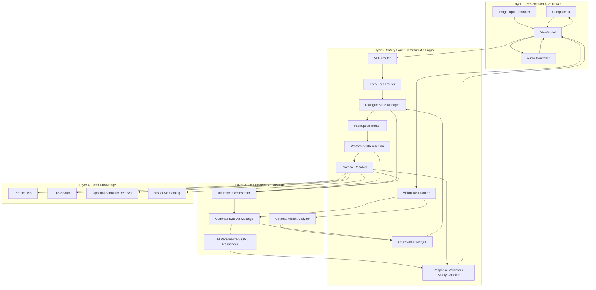

# Offline AI Emergency Response Protocol Mobile App Architecture

## 1. Purpose of This Document

This document is a detailed architecture specification for building an Android-based offline AI emergency response app. The goal is to make the system clear enough that an AI agent or a developer can read this document alone and immediately start building the app skeleton and core modules.

The core principles of this project are:

- The app's **primary functionality** must run **fully on-device**.
- **Triage, branching, and next-action decisions** are handled by deterministic logic.
- The **LLM is responsible for personalizing protocol text, answering in-context questions, and making responses natural**, not for inventing the protocol.
- Even if the LLM is slow or fails, **core protocol guidance must never stop**.
- Ambiguous user inputs should not start from disease labels, but from an **Entry Tree similar to real emergency dispatch workflows**, starting with life-threat assessment.

This app is not a general chatbot. It is designed as a **field-ready protocol executor**.

---

## 2. Product Goals

### 2.1 Core User Value

- Even when the user speaks briefly or vaguely in an emergency, the app quickly classifies the situation.
- The app asks the highest-priority questions first to determine life-threatening risk as early as possible.
- The actual protocol steps come from a structured manual, while the LLM explains them in a user-specific way.
- If the user asks an interrupting question in the middle of step-by-step guidance, the app keeps the current step context.
- The app must work offline.

### 2.2 Non-Goals

- Do not build a final medical diagnosis engine.
- Do not build a free-form medical advice chatbot.
- Do not allow the LLM to generate new core treatment steps from scratch.

---

## 3. System Overview

### 3.1 Design Philosophy

The system is divided into two planes.

1. **Decision Plane**
   - Classifies the current emergency from user input.
   - Rapidly determines whether there is a life threat.
   - Decides which state tree to enter.
   - Decides the next action step.

2. **Response Plane**
   - Re-expresses the chosen step according to the user's situation.
   - Adjusts tone for short guidance, slower guidance, caregiver-facing guidance, and so on.
   - Answers questions asked during a step while preserving the current context.

### 3.2 Core Execution Principles

- **What to do** is decided by the State Machine.
- **How to say it** is decided by the LLM.
- **Whether the current input is a control command, a step-related question, or a new state-changing report** is decided by the Interruption Router.
- **Whether the LLM output drifted away from the protocol** is checked by the Validator.

### 3.3 Multimodal Turn Principle

Every user input turn should be processable as a combination of the following modalities:

- text
- voice transcript
- user-uploaded images
- system context

Core principles:

- Images are **optional input** in every chat flow.
- Visual aid assets are **optional output** in every response.
- The app must still work the same way when no image is provided.
- Image analysis results are not final facts; they are stored as **observation-based candidate facts**.
- Important slots are finalized by the state machine or by explicit user confirmation.

---

## 4. Tech Stack

### 4.1 App and UI

- Language: Kotlin
- UI: Jetpack Compose
- State holder: ViewModel
- Reactive stream: Kotlin Coroutines + `StateFlow`

### 4.2 Audio I/O

- STT: Android `SpeechRecognizer` in offline mode
- TTS: Android `TextToSpeech`
- Barge-in: interrupt TTS when user speech is detected during playback

### 4.3 Image I/O

- Input: CameraX or system photo picker
- Output: local asset images, diagrams, warning illustrations
- Image usage:
  - user-uploaded image: optional evidence input
  - app asset image: optional explanatory output

### 4.4 AI Runtime

- Sponsor tooling: ZETIC Melange
- Primary LLM: Gemma4 E2B (Edge 2B)
- Runtime execution target: CPU / GPU / NPU, with Melange choosing the best backend per device
- Optional vision model: detector / classifier / lightweight vision encoder deployed through Melange
- MVP default: Gemma4 E2B only, using its multimodal capability
- Expansion default: Gemma4 E2B + optional specialized vision model

### 4.5 Knowledge Storage

- Canonical protocol store: JSON assets or SQLite
- Retrieval: SQLite FTS first
- RAG: not required for MVP, optional later
- Visual aid assets: local image assets (`WebP`, `PNG`, `VectorDrawable`)

### 4.6 Data Storage

- Room or SQLite
- Persist app settings, last state, slot cache, and entry history
- Persist multimodal turn history, observed facts, and image analysis results

---

## 5. Layered Architecture



---

## 6. Detailed Module Design

### 6.1 Audio Controller

Responsibilities:

- Start and stop offline STT
- Start and stop TTS
- Detect barge-in
- Normalize audio events into `VoiceEvent`

Core policies:

- If user speech is detected during TTS playback, stop TTS immediately
- Distinguish partial and final STT results, but use final results for state transitions by default
- Provide text input fallback if STT fails

### 6.1b Image Input Controller

Responsibilities:

- Camera capture, gallery selection, and permission handling
- Convert image URIs into safe internal app references
- Attach image metadata to `UserTurn`
- Normalize turns that contain multiple images

Core policies:

- Image input is always optional
- Turn processing continues even if image analysis fails
- Keep original images only when needed, and prefer internal cached references

### 6.2 Compose UI

Responsibilities:

- Render only by observing `UiState`
- Show current step, risk warnings, checklist, timer, and voice status
- Show visual aid images attached to the current step
- Show the user's recent uploaded image and analysis result
- Show manual input, next step, repeat, and emergency-call action buttons

UI principles:

- No marketing-style layout
- Must feel like an emergency tool: simple, fast to scan, and action-first
- The current step, immediate action, and warnings must be at the top
- Visual aids should appear in a fixed place below the current step, and no more than 1-2 should be shown at once

### 6.3 ViewModel

Responsibilities:

- Act as the app's central event hub
- Receive `VoiceEvent`, `UserAction`, and `SystemEvent`
- Assemble text, voice, and image into one `UserTurn`
- Keep `DialogueState`, `UiState`, and `AudioState` synchronized

Recommended structure:

- `EmergencyViewModel`
- `MutableStateFlow<UiState>`
- Internal `reduce(event)` pattern

### 6.4 NLU Router

MVP priority order:

1. regular expressions
2. keyword matching
3. phrase normalization with dictionaries
4. optional TF-IDF or lightweight classifier

Primary outputs:

- `entryIntent`
- `domainHints`
- `slots`
- `confidence`

Examples:

- "My friend collapsed" -> `entryIntent = PERSON_COLLAPSED`
- "There are blisters on the arm" -> `entryIntent = INJURY_REPORT`, `domainHint = BURN`
- "They can't breathe well" -> `entryIntent = BREATHING_PROBLEM`

Important:

- NLU does not make final medical judgments
- NLU is a weak structured layer that helps choose the right state tree

### 6.5 Entry Tree Router

Role:

- Take ambiguous inputs and start with life-threat questions, similar to real dispatch
- Route clear injury reports directly to domain trees

Routing rules:

- **Clear injury/event**: enter `BurnTree`, `BleedingTree`, `ChokingTree`, and so on directly
- **Ambiguous situation**: enter `GeneralEntryTree`
- **Collapse / unresponsiveness**: enter `CollapsedPersonEntryTree`

### 6.5b Vision Task Router

Role:

- Determine the purpose of image interpretation for the current turn before actual image analysis
- Route the same image differently depending on conversation context

Primary outputs:

- `KIT_DETECTION`
- `STEP_VERIFICATION`
- `INJURY_OBSERVATION`
- `GENERAL_MULTIMODAL_QA`
- `UNKNOWN`

Routing signals:

- current `DialogueState`
- current `protocol_id`, `step_id`
- previous system response type
- user text
- expected visual check for the current step

Core principles:

- Separate "what is visible in the image" from "why the user sent the image"
- Determine task purpose based on conversation context, not image content alone
- Start with rule-based routing in MVP and optionally add a lightweight classifier later

### 6.6 Protocol State Machine

Role:

- Maintain the current state node
- Evaluate whether required slots are filled
- Decide the next question or the next action
- Produce `protocol_id`, `step_id`, and `safety_flags`

Node types:

- `question`
- `instruction`
- `route`
- `router`
- `checklist`
- `terminal`

### 6.6b Observation Merger

Role:

- Merge text, voice, and image analysis results into one turn context
- Convert image results into `observed facts`
- Update slot candidates while preserving confidence and source

Core principles:

- Image analysis output starts as `VISION_SUGGESTED`
- Information that affects life-threat branching should be confirmed through the user or a follow-up question
- If it conflicts with user-reported information, preserve the conflict and ask again

### 6.7 Protocol Resolver

Role:

- Retrieve canonical protocol text from structured storage
- Return the current step's source text, prohibitions, follow-up hints, escalation conditions, and linked visual aid assets

Core principles:

- If the state engine already knows the `protocol_id`, use direct lookup first
- Core emergency protocol flows do not require RAG
- Use RAG only for explanation, rationale, and exception handling
- Visual selection is also deterministic and based on protocol metadata, not the LLM

### 6.8 Interruption Router

Role:

- Classify new inputs that arrive while a step is being spoken

Categories:

- `CONTROL_INTENT`
  - example: "done", "next", "stop", "say that again"
- `CLARIFICATION_QUESTION`
  - example: "Why 10 minutes?", "Can I use ice?"
- `STATE_CHANGING_REPORT`
  - example: "Wait, there is bleeding too", "They're breathing strangely"
- `OUT_OF_DOMAIN`

Core behavior:

- Control intents are handled immediately without the LLM
- Clarification questions are sent to the LLM with the current step context
- State-changing reports take priority over the current step and trigger state re-evaluation

### 6.9 Inference Orchestrator

Role:

- Decide when to call Melange-backed models
- Assemble prompts
- Limit tokens
- Manage cancellation, timeouts, and retries
- Select Gemma or an optional vision model for multimodal turns

Examples of when LLM calls are needed:

- canonical step personalization
- answering a question about the current step
- shortening a long instruction
- adjusting phrasing for caregiver / child / panicked user contexts

Examples of when LLM calls are not needed:

- moving to the next step
- completion checks
- repeat current step
- canonical text lookup itself

### 6.9b Vision Analyzer

Role:

- Run an optional specialized vision model on Melange
- Handle structured visual tasks such as object detection, classification, and pose verification

Recommended uses:

- emergency kit recognition
- tool / item detection
- constrained step-result verification

Not recommended:

- final medical diagnosis
- stand-alone life-threat determination
- broad free-form medical interpretation

### 6.10 Safety Checker / Response Validator

Role:

- Verify that LLM output did not drift from the canonical protocol
- Detect missing required keywords, prohibited content, and step order changes

Fallback on failure:

- use canonical text as-is
- or use a short canned response

### 6.11 Visual Aid Resolver

Role:

- Return image assets linked to the current `protocol_id` and `step_id`
- Choose the correct asset variant depending on domain, patient state, and presentation purpose
- Provide captions and accessibility text

Core principles:

- Image selection is always deterministic
- The LLM does not generate images and does not decide which asset to show
- The step must still proceed if no image is available
- Limit default display to at most 2 images per step

---

## 7. Core User Flows

### 7.1 Clear Injury Case

Example: "There are blisters on the arm"

1. Receive STT result
2. Extract `BURN` hint in NLU
3. Enter `BurnTree`
4. Check required slots
5. Resolve `protocol_id = burn_second_degree_general`
6. Protocol Resolver retrieves canonical steps
7. LLM personalizes the step using slot values
8. TTS speaks the result
9. If the user says "done", advance to the next step

### 7.2 Ambiguous Situation Case

Example: "My friend collapsed"

1. Receive STT result
2. NLU produces `entryIntent = PERSON_COLLAPSED`
3. Enter `CollapsedPersonEntryTree`
4. Ask:
   - Is the scene safe?
   - Are they responsive?
   - Are they breathing normally?
5. Depending on the answers:
   - CPR tree
   - unresponsive but breathing tree
   - seizure tree
   - breathing problem tree

### 7.3 Interrupting Question During a Step

Example: during a burn cooling step, the user asks "Can I use ice?"

1. Audio Controller detects barge-in
2. TTS stops immediately
3. Interruption Router classifies it as `CLARIFICATION_QUESTION`
4. Call the LLM with current step context and prohibitions
5. Validator checks the answer
6. Return to the current step afterward

### 7.4 Response With Visual Aid

Example: a CPR step or a bandaging step

1. State Machine decides the current `protocol_id` and `step_id`
2. Protocol Resolver returns step metadata and `asset_refs`
3. Visual Aid Resolver loads the actual image file and caption from the asset catalog
4. ViewModel updates `UiState.visualAids`
5. Compose UI displays the image below the step text
6. The LLM may optionally generate a short companion explanation or personalize the canonical text

### 7.5 User Turn With Image Input

Example: "Did I wrap the bandage correctly?" + image

1. The user creates a turn with one or more of text, voice, or image
2. ViewModel normalizes it into a `UserTurn`
3. If an image is present, `Vision Task Router` decides the task purpose
4. In MVP, Gemma4 E2B handles the multimodal input directly
5. In the expansion profile, route to an optional vision model or Gemma depending on task type
6. Merge the result into a list of `ObservedFact`
7. State Machine asks follow-up questions if needed or generates a response for current-step verification

---

## 8. Real Dispatch-Style Entry Tree Design

### 8.1 Design Criteria

State trees should be created using these criteria:

- Does this question actually change the next action?
- Can the user answer it by observing the situation right now?
- Even if the answer is wrong, does it avoid dangerous deviation?

### 8.2 Tree Types

1. **Entry / Triage Tree**
   - Handles ambiguous inputs
   - Prioritizes life-threat assessment

2. **Domain-Specific Tree**
   - burn
   - bleeding
   - seizure
   - choking
   - chest pain
   - poisoning
   - unresponsiveness / cardiac arrest

### 8.3 Recommended Top-Level Entry Tree

```text
Root Entry
├─ Clear injury / event
│  ├─ burn
│  ├─ bleeding
│  ├─ trauma
│  ├─ choking
│  └─ poisoning
├─ Ambiguous condition / symptom
│  ├─ collapse
│  ├─ breathing difficulty
│  ├─ chest pain
│  ├─ seizure
│  ├─ altered consciousness
│  └─ possible allergic reaction
└─ General / unclear
   └─ GeneralEntryTree
```

### 8.4 Recommended Collapsed Person Entry Tree Flow

```text
1. Is the scene safe?
2. Is the patient responsive?
3. Are they breathing normally?
4. Is there severe bleeding?
5. Are they actively seizing?
6. Is there a known cause? (trauma / heat / drugs / diabetes, etc.)
```

---

## 9. RAG Strategy

### 9.1 Conclusion

RAG is not required in the core protocol path.

### 9.2 Direct Lookup First

Use direct lookup for:

- standard steps
- checklists
- prohibitions
- next steps
- escalation conditions

### 9.3 When RAG Is Useful

- when referencing long unstructured documents
- when the user asks explanatory "why" questions
- when exception combinations become numerous
- when the manual set expands later

### 9.4 Recommended Adoption Order

1. canonical protocols in JSON / SQLite
2. SQLite FTS
3. semantic retrieval if needed

---

## 10. Melange + Gemma4 E2B Integration Strategy

### 10.1 Role Definition

Melange is not just a model runner. It is responsible for:

- device-side model deployment
- CPU / GPU / NPU benchmarking
- optimal backend selection
- model loading and session management

Gemma4 E2B is responsible for:

- canonical step personalization
- answering questions related to the current step
- summarization / paraphrasing
- adapting phrasing to the user's style
- general multimodal interpretation of image-containing turns in MVP
- receiving vision results and producing natural-language response plus structured explanation in the expansion profile

Gemma4 E2B should not be used for:

- final medical decision making
- generating completely new protocols
- adding unverified steps
- acting as the final execution engine for object detection tasks better handled by a specialized detector

### 10.2 Architecture Profiles

This project should support the following two profiles from the start.

#### Profile A. Gemma-only MVP

Goal:

- the fastest hackathon-ready version
- images are supported, but Gemma4 E2B is the only model used

How image processing works:

- `Vision Task Router` still classifies the purpose
- Gemma4 E2B performs the actual visual interpretation
- output is normalized into `ObservedFact` JSON

Advantages:

- simpler implementation
- lower deployment and debugging overhead
- faster path to a multimodal demo

Constraints:

- lower efficiency for repetitive tasks like kit detection or step verification
- structured detection quality may be less stable than with a specialized vision model

#### Profile B. Hybrid Vision Expansion

Goal:

- improve speed and reliability for repetitive, structured visual tasks
- keep Gemma focused on dialogue, explanation, and integrated reasoning

How image processing works:

- `Vision Task Router` classifies the purpose
- constrained tasks such as `KIT_DETECTION` and `STEP_VERIFICATION` use a specialized vision model
- `GENERAL_MULTIMODAL_QA` and context-heavy visual questions use Gemma4 E2B
- both outputs are merged through the same `ObservedFact` interface

Advantages:

- better speed
- better battery and compute efficiency
- easier structured output for state-machine slots

Constraints:

- greater operational complexity with 2+ models
- broader routing logic and test coverage

### 10.3 Design Rule: Make MVP Ready for Hybrid Expansion

Even in MVP, introduce these interfaces first:

- `VisionTaskRouter`
- `MultimodalInterpreter`
- `ObservedFact`
- `TurnContext`

That means the upper layers already use interfaces that can switch to hybrid later, even if MVP has only one implementation.

Example:

- MVP: `GemmaMultimodalInterpreter`
- Expansion: `HybridMultimodalInterpreter`

### 10.4 Melange Adapter Interfaces

Recommended interfaces:

```kotlin
interface OnDeviceLlmEngine {
    suspend fun warmup(): Result<Unit>
    suspend fun generate(request: LlmRequest): Result<LlmResponse>
    suspend fun cancelCurrent()
    fun backendInfo(): ModelBackendInfo
}
```

```kotlin
interface MultimodalInterpreter {
    suspend fun interpret(turn: UserTurn, context: TurnContext): Result<List<ObservedFact>>
}
```

```kotlin
interface VisionModelEngine {
    suspend fun analyze(task: VisionTaskType, turn: UserTurn, context: TurnContext): Result<List<ObservedFact>>
    fun backendInfo(): ModelBackendInfo
}
```

### 10.5 Example Implementations

Gemma MVP:

- `GemmaMultimodalInterpreter`
  - internally sends image + text to Gemma4 E2B
  - outputs structured `ObservedFact` JSON

Hybrid expansion:

- `HybridMultimodalInterpreter`
  - receives the result of `VisionTaskRouter`
  - uses `VisionModelEngine` for specialized tasks
  - uses `OnDeviceLlmEngine` for general multimodal reasoning
  - normalizes all results into one `ObservedFact` list

### 10.6 Inference Policy

- keep prompts short
- prefer structured JSON outputs
- always configure timeouts
- fall back to canonical response if needed
- image turns should also prefer structured observation output
- if no specialized vision model is present, use Gemma through the same interface as fallback

---

## 11. Data Model

### 11.1 Multimodal User Turn

```kotlin
data class UserTurn(
    val text: String? = null,
    val voiceTranscript: String? = null,
    val imageUris: List<String> = emptyList(),
    val timestamp: Long
)
```

### 11.2 Observation Model

```kotlin
data class ObservedFact(
    val key: String,
    val value: String,
    val confidence: Float,
    val source: FactSource,
    val evidence: String? = null
)

enum class FactSource {
    USER_REPORTED,
    USER_CONFIRMED,
    VISION_SUGGESTED,
    SYSTEM_INFERRED
}

enum class VisionTaskType {
    KIT_DETECTION,
    STEP_VERIFICATION,
    INJURY_OBSERVATION,
    GENERAL_MULTIMODAL_QA,
    UNKNOWN
}

data class TurnContext(
    val dialogueState: DialogueState?,
    val currentProtocolId: String?,
    val currentStepId: String?,
    val lastAssistantAction: String? = null,
    val expectedVisualCheck: String? = null
)
```

### 11.3 Core Dialogue State

```kotlin
sealed class DialogueState {
    data class EntryMode(
        val treeId: String,
        val nodeId: String,
        val slots: Map<String, String>,
        val history: List<String>
    ) : DialogueState()

    data class ProtocolMode(
        val scenarioId: String,
        val protocolId: String,
        val stepIndex: Int,
        val slots: Map<String, String>,
        val isSpeaking: Boolean,
        val suspendedByQuestion: Boolean = false
    ) : DialogueState()

    data class QuestionMode(
        val scenarioId: String,
        val protocolId: String,
        val stepIndex: Int,
        val userQuestion: String,
        val returnToStepIndex: Int
    ) : DialogueState()

    data class ReTriageMode(
        val previousScenarioId: String?,
        val newInput: String
    ) : DialogueState()

    data object Completed : DialogueState()
}
```

### 11.4 UI State

```kotlin
data class UiState(
    val title: String,
    val primaryInstruction: String,
    val secondaryInstruction: String? = null,
    val warningText: String? = null,
    val checklist: List<ChecklistItem> = emptyList(),
    val visualAids: List<VisualAid> = emptyList(),
    val currentStep: Int = 0,
    val totalSteps: Int = 0,
    val isListening: Boolean = false,
    val isSpeaking: Boolean = false,
    val showCallEmergencyButton: Boolean = false
)
```

```kotlin
data class VisualAid(
    val assetId: String,
    val type: VisualAidType,
    val caption: String? = null,
    val contentDescription: String,
    val priority: Int = 0
)

enum class VisualAidType {
    IMAGE,
    WARNING_ILLUSTRATION,
    DIAGRAM
}
```

### 11.5 Event Model

```kotlin
sealed class AppEvent {
    data class VoiceTranscript(val text: String, val isFinal: Boolean) : AppEvent()
    data class UserSubmittedTurn(val turn: UserTurn) : AppEvent()
    data class UserTappedAction(val action: UiAction) : AppEvent()
    data class TtsCompleted(val utteranceId: String) : AppEvent()
    data class TtsInterrupted(val reason: String) : AppEvent()
    data class LlmCompleted(val response: LlmResponse) : AppEvent()
    data class LlmFailed(val error: String) : AppEvent()
}
```

---

## 12. State Tree Schema

### 12.1 Base Schema

```json
{
  "tree_id": "entry_general_emergency",
  "version": "1.0",
  "start_node": "scene_safe",
  "nodes": []
}
```

Each node may contain the following fields:

- `id`
- `type`
- `prompt`
- `instruction_id`
- `slot_key`
- `transitions`
- `routes`
- `next`
- `safety_flags`

### 12.2 Example: Entry Tree

```json
{
  "tree_id": "collapsed_person_entry",
  "version": "1.0",
  "start_node": "scene_safe",
  "nodes": [
    {
      "id": "scene_safe",
      "type": "question",
      "prompt": "Is the area safe?",
      "slot_key": "scene_safe",
      "transitions": [
        { "when": "yes", "to": "responsive_check" },
        { "when": "no", "to": "safety_instruction" }
      ]
    },
    {
      "id": "safety_instruction",
      "type": "instruction",
      "instruction_id": "ensure_scene_safety",
      "next": "responsive_check"
    },
    {
      "id": "responsive_check",
      "type": "question",
      "prompt": "Is the person responsive?",
      "slot_key": "responsive",
      "transitions": [
        { "when": "no", "to": "breathing_check" },
        { "when": "yes", "to": "major_symptom_router" }
      ]
    },
    {
      "id": "breathing_check",
      "type": "question",
      "prompt": "Are they breathing normally? Treat gasping as no.",
      "slot_key": "breathing_normal",
      "transitions": [
        { "when": "no", "to_tree": "cardiac_arrest_tree" },
        { "when": "yes", "to_tree": "unresponsive_breathing_tree" }
      ]
    },
    {
      "id": "major_symptom_router",
      "type": "router",
      "routes": [
        { "if": "has_massive_bleeding", "to_tree": "bleeding_tree" },
        { "if": "has_choking_signs", "to_tree": "choking_tree" },
        { "if": "has_seizure_signs", "to_tree": "seizure_tree" },
        { "if": "has_breathing_problem", "to_tree": "breathing_problem_tree" }
      ],
      "fallback_to": "general_assessment_tree"
    }
  ]
}
```

### 12.3 Protocol Schema

```json
{
  "protocol_id": "burn_second_degree_general",
  "title": "Second-degree burn basic care",
  "category": "burn",
  "required_slots": ["location"],
  "safety_flags": ["show_emergency_call_if_face_or_airway"],
  "steps": [
    {
      "step_id": "cool_water",
      "canonical_text": "Cool the burn area under cool running water for at least 10 minutes.",
      "must_keep_keywords": ["running water", "10 minutes"],
      "forbidden_keywords": ["direct ice", "pop blisters"],
      "asset_refs": [
        {
          "asset_id": "burn_cool_water_arm_01",
          "type": "image",
          "caption": "Example of cooling the burn under running water",
          "content_description": "An arm burn being held under cool running water",
          "priority": 10
        }
      ]
    },
    {
      "step_id": "cover_clean",
      "canonical_text": "Loosely cover the area with a clean cloth or gauze.",
      "must_keep_keywords": ["clean cloth", "loosely cover"],
      "asset_refs": [
        {
          "asset_id": "burn_cover_gauze_01",
          "type": "image",
          "caption": "How to loosely cover with gauze",
          "content_description": "Clean gauze placed over a burn area",
          "priority": 10
        }
      ]
    }
  ]
}
```

### 12.4 Visual Asset Catalog Schema

You may include `asset_refs` directly in protocol steps, but for asset reuse and variant management, a separate catalog is recommended.

```json
{
  "asset_id": "cpr_hand_position_01",
  "file_name": "cpr_hand_position_01.webp",
  "type": "image",
  "tags": ["cpr", "adult", "hand_position"],
  "usage_scope": ["cardiac_arrest_tree", "adult_cpr_protocol"],
  "caption": "Hand placement and arm posture",
  "content_description": "CPR posture with both hands stacked on the center of the chest and arms straight",
  "variants": {
    "light": "cpr_hand_position_01.webp",
    "dark": "cpr_hand_position_01_dark.webp"
  }
}
```

Recommended rules:

- `asset_id` must be globally unique
- protocol steps should preferably reference only `asset_id`, while the catalog manages actual file paths
- if the same concept has adult / child / front / side versions, model them as variants
- if no image exists, set `asset_refs` to an empty array

---

## 13. LLM Request / Response Schema

### 13.1 Personalization Request

```json
{
  "mode": "personalize_step",
  "scenario_id": "burn",
  "protocol_id": "burn_second_degree_general",
  "step_id": "cool_water",
  "canonical_text": "Cool the burn area under cool running water for at least 10 minutes.",
  "slots": {
    "location": "arm",
    "patient_type": "adult",
    "panic_level": "high"
  },
  "constraints": {
    "do_not_add_new_steps": true,
    "do_not_remove_required_details": true,
    "keep_keywords": ["running water", "10 minutes"],
    "forbidden_content": ["use ice directly", "pop blisters"]
  },
  "style": {
    "tone": "calm",
    "length": "short",
    "target_listener": "caregiver"
  }
}
```

### 13.2 Clarification QA Request

```json
{
  "mode": "answer_question",
  "scenario_id": "burn",
  "protocol_id": "burn_second_degree_general",
  "current_step_id": "cool_water",
  "user_question": "Can I use ice instead of cool water?",
  "canonical_text": "Cool the burn area under cool running water for at least 10 minutes.",
  "known_prohibitions": ["Do not apply ice directly.", "Do not pop blisters."],
  "constraints": {
    "answer_only_within_current_context": true,
    "do_not_change_protocol_order": true,
    "do_not_make_new_diagnosis": true
  }
}
```

### 13.3 LLM Response

```json
{
  "response_type": "personalized_step",
  "spoken_text": "Cool the burn on the arm under cool running water for at least 10 minutes.",
  "summary_text": "Cool with running water for 10 minutes",
  "safety_notes": ["Do not apply ice directly."],
  "resume_policy": "resume_same_step"
}
```

---

## 14. LLM Prompt Policy

### 14.1 System-Level Rules

- Do not invent a new emergency protocol
- Preserve the meaning of the canonical instruction
- Explain only what is needed for the current step
- Do not make a new diagnosis
- Do not add, remove, or reorder steps
- Output must be JSON

### 14.2 Validator Rules

Check the following:

- inclusion of `must_keep_keywords`
- absence of `forbidden_keywords`
- response length limits
- whether the response suggests actions outside the current step

On failure:

- use `canonical_text` as-is
- or use a canned app response

---

## 15. Interruption and Step Resume Design

### 15.1 Routing Priority

When a new user input arrives, classify it in this order:

1. `STATE_CHANGING_REPORT`
2. `CONTROL_INTENT`
3. `CLARIFICATION_QUESTION`
4. `OUT_OF_DOMAIN`

### 15.2 Resume Policies

- `resume_same_step`
  - answer the question, then briefly re-read the current step
- `resume_next_step`
  - move to the next step if completion was confirmed
- `retriage`
  - re-enter Entry Tree or re-evaluate the current tree when new symptoms are reported

### 15.3 Runtime Context That Must Be Stored

- `currentTreeId`
- `currentNodeId`
- `currentProtocolId`
- `currentStepIndex`
- `activeSlots`
- `pendingChecklist`
- `suspendedByQuestion`
- `lastSpokenCanonicalText`

---

## 16. Recommended Package Structure

```text
app/
  src/main/java/com/example/emergencyai/
    MainActivity.kt

    ui/
      EmergencyApp.kt
      screen/
        HomeScreen.kt
        ActiveProtocolScreen.kt
      component/
        StepCard.kt
        WarningBanner.kt
        VoiceStatusBar.kt
        VisualAidStrip.kt

    presentation/
      EmergencyViewModel.kt
      UiState.kt
      UiAction.kt
      AppEvent.kt

    audio/
      AudioController.kt
      AndroidSpeechRecognizer.kt
      AndroidTtsEngine.kt
      VoiceEvent.kt

    imaging/
      ImageInputController.kt
      CameraCaptureManager.kt
      GalleryPickerManager.kt

    domain/
      model/
        DialogueState.kt
        EntryIntent.kt
        DomainIntent.kt
        UserTurn.kt
        ObservedFact.kt
        TurnContext.kt
        VisionTaskType.kt
        SlotMap.kt
        Protocol.kt
        ProtocolStep.kt
        VisualAid.kt
      nlu/
        NluRouter.kt
        RegexIntentMatcher.kt
        SlotExtractor.kt
      state/
        EntryTreeRouter.kt
        ProtocolStateMachine.kt
        DialogueStateManager.kt
        InterruptionRouter.kt
        VisionTaskRouter.kt
        ObservationMerger.kt
      safety/
        ResponseValidator.kt
        SafetyPolicy.kt
      usecase/
        HandleUserTurnUseCase.kt
        HandleTranscriptUseCase.kt
        AdvanceStepUseCase.kt
        AnswerQuestionUseCase.kt
        AnalyzeImageTurnUseCase.kt

    data/
      protocol/
        ProtocolRepository.kt
        JsonProtocolDataSource.kt
        FtsProtocolSearch.kt
      visual/
        VisualAssetRepository.kt
        AssetCatalogDataSource.kt
      local/
        AppDatabase.kt
        SessionDao.kt

    ai/
      melange/
        MelangeLlmEngine.kt
        MelangeModelManager.kt
        MelangeVisionModelEngine.kt
      orchestrator/
        InferenceOrchestrator.kt
        MultimodalInterpreter.kt
        GemmaMultimodalInterpreter.kt
        HybridMultimodalInterpreter.kt
      prompt/
        PromptFactory.kt
      model/
        LlmRequest.kt
        LlmResponse.kt

    assets/
      protocols/
        entry_general_emergency.json
        collapsed_person_entry.json
        cardiac_arrest_tree.json
        unresponsive_breathing_tree.json
        burn_tree.json
      visuals/
        asset_catalog.json
        images/
          cpr_hand_position_01.webp
          burn_cool_water_arm_01.webp
          bandage_wrap_arm_01.webp
      demo_inputs/
        sample_kit_photo.jpg
        sample_bandage_result.jpg
      knowledge/
        faq_burn.json
        faq_bleeding.json
```

---

## 17. Repository / UseCase Design

### 17.1 Repository

- `ProtocolRepository`
  - `getTree(treeId)`
  - `getProtocol(protocolId)`
  - `searchSupportingDocs(query)`

- `VisualAssetRepository`
  - `getAssetsForStep(protocolId, stepId)`
  - `resolveAsset(assetId)`
  - `getFallbackAssets(tags)`

- `VisionObservationRepository`
  - `saveObservedFacts(turnId, facts)`
  - `getRecentObservedFacts(sessionId)`
  - `resolveConflicts()`

- `SessionRepository`
  - store current step, last slots, and recent context

### 17.2 UseCase

- `HandleTranscriptUseCase`
  - main entry point for free-form speech/text

- `HandleUserTurnUseCase`
  - main entry point for multimodal turns combining text / voice / image

- `AdvanceStepUseCase`
  - handle "next" and "done"

- `RepeatInstructionUseCase`
  - replay current step

- `GetVisualAidsForStepUseCase`
  - load visual aids attached to the current step

- `AnalyzeImageTurnUseCase`
  - send image-containing turns through Vision Task Router and interpreter

- `AnswerQuestionUseCase`
  - handle interruption questions

- `ReTriageUseCase`
  - re-evaluate state when new symptoms appear

---

## 18. UI/UX Behavior Rules

### 18.1 Main Screen Layout

- current state title
- one immediate action
- warnings
- visual aid image or diagram
- step progress
- listening / speaking state
- manual buttons
  - replay
  - next step
  - emergency call
  - correct input

### 18.2 TTS Rules

- do not read overly long sentences at once
- read the step and warning separately
- after answering a question, use a short resume phrase

Examples:

- "I'll answer that question."
- "Let's continue."
- "Returning to the current step."

### 18.3 Visual Aid Display Rules

- Show only images directly related to the current step
- Show 1 image by default and at most 2
- Place images below text so they do not distract from the core action
- Keep captions short and action-oriented
- Always provide `contentDescription` for accessibility
- Steps without images must still render cleanly with no layout jump

### 18.4 User Image Input Rules

- Users may optionally attach an image on any turn
- Image attachment complements text / voice rather than replacing them
- Result-check images should be clearly tied to the current step
- If analysis fails, the user must still be able to continue by speaking, typing, or retaking the photo

---

## 19. Safety Rules

### 19.1 App-Level Rules

- In risky situations, emergency-call guidance should be shown first
- The app must not overstate medical authority
- When uncertain, branch toward the safer option
- If the system cannot decide, ask another question or escalate

### 19.2 LLM Safety Rules

- Allow only canonical-text-based responses
- Do not add or remove steps
- Do not provide speculative medical advice
- Limit answers to the current step context

### 19.3 STT Failure Handling

- "I didn't catch that" fallback
- repeat the same question
- text input fallback

---

## 20. Performance Strategy

### 20.1 App Startup

- lazily warm up the Melange model
- preload Entry Tree and commonly used protocols

### 20.2 On-Device Inference

- keep responses short
- prefer structured JSON output
- skip LLM calls for cases that do not need them

### 20.3 Low-End Device Strategy

- allow direct canonical step playback without LLM
- degrade personalization when necessary
- support a retrieval-free mode

---

## 21. Implementation Priorities

### 21.1 Hackathon MVP

Must include:

- Compose UI
- offline STT / TTS
- Entry Tree
- `BurnTree`, `BleedingTree`, `CollapsedPersonEntryTree`
- deterministic state machine
- direct protocol lookup
- per-step visual aid display
- Melange + Gemma4 E2B step personalization
- optional image-input handling using Gemma4 E2B
- `VisionTaskRouter` and `ObservedFact` interfaces
- interruption handling
- validator + fallback

MVP image policy:

- do not add a specialized vision model yet
- image-containing turns are interpreted directly by Gemma4 E2B
- still store outputs in the standardized `ObservedFact` structure from day one

### 21.2 Stretch Goals

- SQLite FTS for explanation retrieval
- more domain trees
- multilingual support
- style adaptation for panicked users
- per-device Melange backend benchmark storage
- add a specialized vision model
- add a detector specifically for emergency kit recognition
- add a dedicated vision path for step verification

### 21.3 Hybrid Expansion Scope

Tasks to split out first in the expansion profile:

1. `KIT_DETECTION`
2. `STEP_VERIFICATION`

Tasks Gemma should continue to handle:

- general image-inclusive Q&A
- context-heavy explanation
- converting vision results into natural-language responses

---

## 22. Test Strategy

### 22.1 Unit Tests

- NLU intent classification
- slot extraction
- state transitions
- interruption classification
- vision task routing
- observation merge conflict resolution
- validator

### 22.2 Integration Tests

- transcript -> tree routing
- protocol resolution
- visual asset resolution
- image turn -> observed facts
- LLM request assembly
- fallback path

### 22.3 Scenario Tests

- "There are blisters on the arm"
- "My friend collapsed"
- interrupt during a step: "Can I use ice?"
- interrupt during a step: "Wait, there is bleeding"
- CPR step shows hand position image
- "Did I wrap the bandage correctly?" + image
- "What in this emergency kit can I use?" + image

### 22.4 Field Demo Tests

- offline mode
- low-end device
- barge-in during TTS
- STT failure and retry

---

## 23. Final Rules That Must Be Preserved During Implementation

1. The core app flow must not stop even without the LLM.
2. State trees must be designed around **observable state and immediate action**, not disease names.
3. Ambiguous inputs must start in the Entry Tree.
4. Protocol source text must come from structured storage.
5. The LLM is a protocol personalization engine, not a protocol generation engine.
6. Image input is always optional evidence, and the app must work the same way without it.
7. The app must not lose the current step context when a question interrupts.
8. Every response should reduce anxiety and drive immediate action.

---

## 24. Recommended Initial Build Order

1. Define `DialogueState`, `UiState`, and `AppEvent`
2. Define `UserTurn`, `ObservedFact`, `TurnContext`, and `VisionTaskType`
3. Build skeletons for `AudioController` and `ImageInputController`
4. Implement `NluRouter`, `EntryTreeRouter`, and `VisionTaskRouter`
5. Implement JSON-based `ProtocolRepository` and `VisualAssetRepository`
6. Implement `ProtocolStateMachine` and `ObservationMerger`
7. Connect `EmergencyViewModel` to the multimodal event loop
8. Add `MelangeLlmEngine` and `GemmaMultimodalInterpreter`
9. Add `PromptFactory` and `ResponseValidator`
10. Add interruption handling
11. Run integration tests with `BurnTree`, `CollapsedPersonEntryTree`, and image-containing turns

### 24.1 Hybrid Expansion Transition Order

After MVP, expand in this order:

1. Add `VisionModelEngine` interface
2. Implement `MelangeVisionModelEngine`
3. Implement `HybridMultimodalInterpreter`
4. Connect a specialized model for `KIT_DETECTION`
5. Split out `STEP_VERIFICATION`
6. Compare performance / accuracy and keep Gemma fallback

---

## 25. One-Sentence Summary

This project is an offline emergency response app that first triages life threat through a real-dispatch-style Entry Tree, uses a deterministic state machine to decide the next action, uses Gemma4 E2B running on Melange to interpret multimodal turns including text, voice, and images and to personalize the response safely, and can later expand on the same interfaces with specialized vision models in a hybrid architecture.
